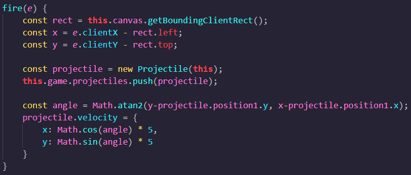

# Lost Stars

Lost Stars is a 2D game where the player navigates through space to unlock and restore the constellations back into the night sky. The player will cruise around in a spaceship to search for the key while defending itself from incoming enemies.

## Functionality and MVPs

In Lost Stars, players will be able to:
- control the spaceship using arrow keys
- shoot incoming enemies
- unlock one constellation per level
- replenish health or lose if no health

In addition, this project will include:
- brief storyline
- game instructions and control explanations
- background music
- production README

## Wireframe

- Nav links will include links to this project's GitHub repo and other references
- Controls will include a mute button to turn the background music on or off
- Options will allow the player to restart or exit the game

## Projectile Calculation
- An interesting set of code involves the projectile calculations as it takes into account the position of the spaceship and where the player clicks to find the angle:

## Technologies, Libraries, APIs
- Canvas API
- Javascript
- HTML
- CSS

## Future Considerations
- add levels to unlock more constellations
- make different enemies with various difficulty levels